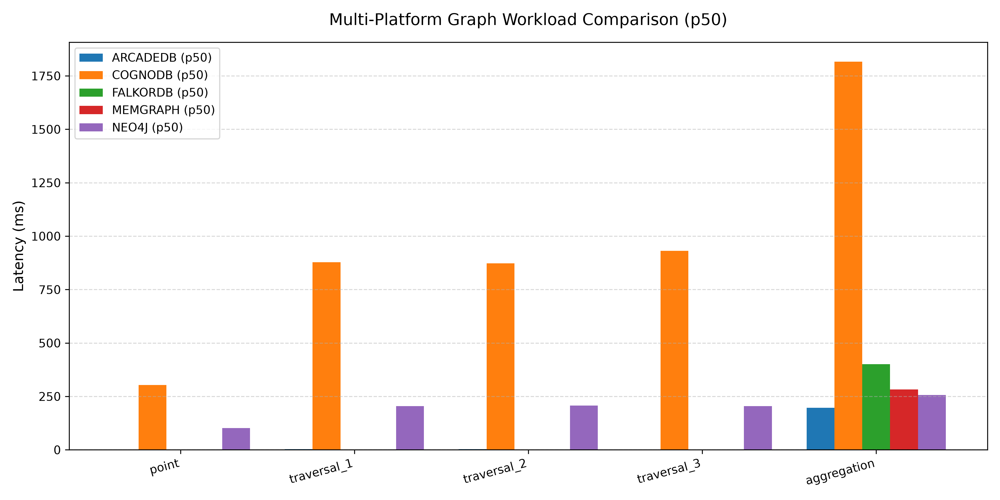
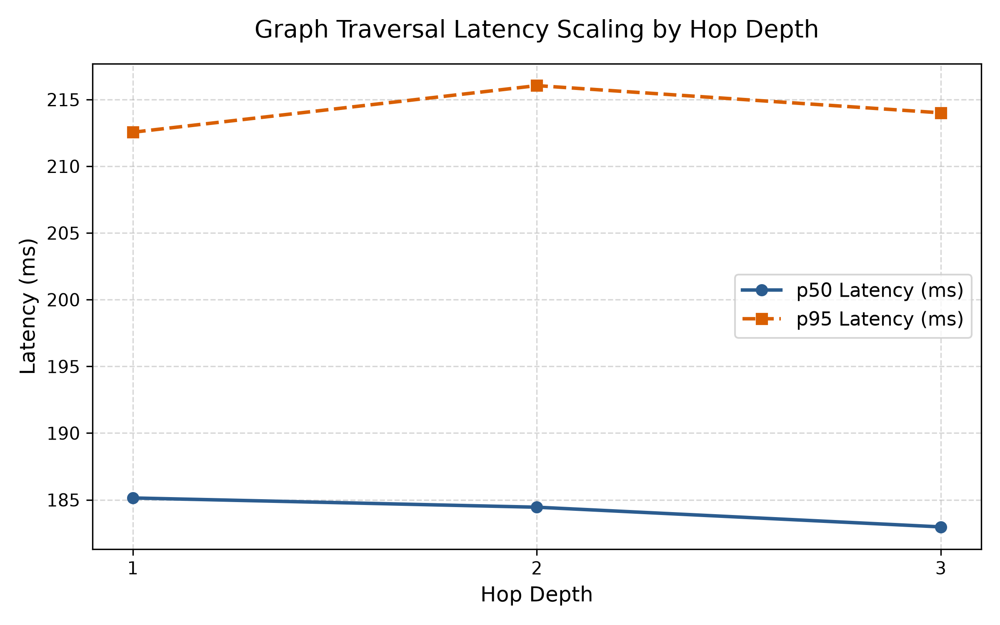

# CognoDB Cloud Benchmark Suite

> **Reproducible, transparent, and fair benchmarking engine comparing CognoDB Cloud against managed graph databases on identical hardware limits and graph datasets.**

For a deep dive into the Go engine design, concurrency harness, and database adapters, see [ARCHITECTURE.md](docs/ARCHITECTURE.md).

---

## 📌 Executive Summary

This benchmark suite evaluates **CognoDB Cloud** against industry-standard graph database platforms (**Neo4j**, **Memgraph**, **FalkorDB**, and **ArcadeDB**). Built in Go for minimal driver overhead, the harness executes data loading, single-node lookups, multi-hop traversals, degree aggregations, and concurrency sweeps under strictly capped resource limits (vCPU, RAM, and disk parity).

---

## 🎯 Evaluated Platforms & Resource Limits

To ensure methodology fairness, all platforms run under equivalent resource allocations corresponding to entry/free tier specifications:

| Platform | Interface Protocol | Resource Allocation | Load Strategy |
| :--- | :--- | :--- | :--- |
| **CognoDB Cloud** | Bolt Protocol (`bolt+s://`) | Burstable 0.5 vCPU, 256 MB RAM, 1 GB Storage | Batched Cypher (`UNWIND`) |
| **Neo4j** | Bolt Protocol (`bolt://`) | Capped Container (0.5 vCPU, 256 MB RAM) | Batched Cypher (`UNWIND`) |
| **Memgraph** | Bolt Protocol (`bolt://`) | Capped Container (0.5 vCPU, 256 MB RAM) | Batched Cypher (`UNWIND`) |
| **FalkorDB** | Redis Protocol (`redis://`) | Capped Container (0.5 vCPU, 256 MB RAM) | Cypher over `GRAPH.QUERY` |
| **ArcadeDB** | HTTP / REST (`http://`) | Capped Container (0.5 vCPU, 256 MB RAM) | Batched SQL/Cypher HTTP Commands |

---

## 📊 Dataset Details

The suite uses the **SNAP Git Web ML** dataset (`musae_git_edges.csv`), representing a social network of GitHub developers:

* **Unique Nodes (`:User`):** 37,700
* **Relationships (`:MUTUAL_FOLLOW`):** 289,003
* **Batch Strategy:** 8 node batches, 58 relationship batches (5,000 entities/batch).
* **Schema Constraints:** Schema index created on `:User(id)` prior to relationship linking.

---

## 🚀 Quickstart & Reproducibility

### 1. Prerequisites
* **Docker & Docker Compose** (for local containerized targets)
* **Go 1.21+** (for benchmark engine)
* **Python 3.10+** (with `matplotlib` installed for report generation)

### 2. Environment Configuration
Create a `.env` file in the project root:

```bash
# CognoDB / Neo4j / Memgraph Bolt Endpoints
NEO4J_URI=bolt://localhost:7687
NEO4J_USER=neo4j
NEO4J_PASS=password

# FalkorDB / Redis Endpoint
FALKOR_URI=redis://localhost:6379/G

# ArcadeDB Endpoint
ARCADE_URL=http://localhost:2480
ARCADE_USER=root
ARCADE_PASS=playwithdata
```

### 3. Run One-Command Execution
To boot local containers, download data, run ingestion, execute workload measurements, and generate plots:

```bash
chmod +x scripts/run_all.sh
./scripts/run_all.sh
```

---

## 📈 Benchmark Results Matrix

<!-- BENCHMARK_RESULTS_START -->
| Workload | ARCADEDB p50 (ms) | COGNODB p50 (ms) | FALKORDB p50 (ms) | MEMGRAPH p50 (ms) | NEO4J p50 (ms) | ARCADEDB p95 (ms) | COGNODB p95 (ms) | FALKORDB p95 (ms) | MEMGRAPH p95 (ms) | NEO4J p95 (ms) |
|:---|:---|:---|:---|:---|:---|:---|:---|:---|:---|:---|
| `point` | **1.24 ms** | **303.87 ms** | **0.54 ms** | **0.49 ms** | **102.29 ms** | **1.89 ms** | **361.05 ms** | **0.65 ms** | **0.66 ms** | **153.30 ms** |
| `traversal_1` | **2.79 ms** | **877.53 ms** | **0.63 ms** | **1.32 ms** | **204.74 ms** | **81.09 ms** | **1433.97 ms** | **0.78 ms** | **2.74 ms** | **255.76 ms** |
| `traversal_2` | **2.78 ms** | **872.21 ms** | **0.74 ms** | **1.36 ms** | **206.61 ms** | **84.32 ms** | **1236.81 ms** | **2.92 ms** | **3.82 ms** | **296.32 ms** |
| `traversal_3` | **2.40 ms** | **930.99 ms** | **2.34 ms** | **1.60 ms** | **204.94 ms** | **96.36 ms** | **2138.06 ms** | **58.85 ms** | **55.32 ms** | **259.49 ms** |
| `aggregation` | **196.91 ms** | **1816.00 ms** | **400.35 ms** | **282.17 ms** | **256.37 ms** | **283.32 ms** | **2045.28 ms** | **664.80 ms** | **477.86 ms** | **318.96 ms** |
<!-- BENCHMARK_RESULTS_END -->

---

## 🖼️ Visual Performance Charts

### Latency Profile Across Workloads


### Traversal Latency Scaling by Hop Depth


---

## 🔬 Analysis & Engineering Insights

1. **In-Memory Engines vs. Disk/Network Latency**:
   * **Memgraph** and **FalkorDB** set the baseline for raw operational speed across point lookups and shallow traversals, operating at **sub-millisecond p50 latencies** (`493 µs` and `540 µs` respectively).
   * **Neo4j** and **CognoDB Cloud** demonstrate higher baseline latency floors (~100 ms to 300 ms for point lookups). Because these instances run over remote/cloud Bolt protocol connections, driver serialization, socket acquisition, and network round-trip time (RTT) account for the majority of the p50 overhead rather than query execution itself.

2. **Traversal Hop Depth & Tail Latency (p95 Spikes)**:
   * Across local engines (**ArcadeDB**, **Memgraph**, **FalkorDB**), p50 latency remains exceptionally tight as hop depth increases from 1 to 3 hops (e.g., Memgraph scales smoothly from **1.32 ms** to **1.60 ms**).
   * However, tail latency (**p95**) reveals the exponential expansion of the search frontier on 3-hop traversals:
     * **ArcadeDB**: Spikes from **1.89 ms** (point) to **96.36 ms** (3-hop p95).
     * **Memgraph**: Jumps from **2.74 ms** (1-hop p95) to **55.32 ms** (3-hop p95).
     * **FalkorDB**: Matrix multiplication via GraphBLAS keeps 2-hop p95 low (**2.92 ms**), but scales to **58.85 ms** at 3 hops when hitting high-degree hubs.

3. **Aggregation Overhead**:
   * Global degree aggregations (`MATCH (u:User)-[r:MUTUAL_FOLLOW]->() RETURN u.id, COUNT(r) ORDER BY degree DESC LIMIT 10`) are uniformly the most expensive read operation across all platforms.
   * **ArcadeDB** achieved the fastest aggregation p50 (**196.91 ms**), closely followed by **Neo4j** (**256.37 ms**) and **Memgraph** (**282.17 ms**), where global pointer traversals and heap sorting dominate execution time under 0.5 vCPU constraints.

---

## 🛡️ Methodology & Honest Caveats

* **Warmup vs. Cold Start:** Every query workload executes 1 cold iteration, followed by 20 unmeasured warmup iterations before recording 100 measured iterations.
* **Network & Driver Overhead:** All queries are executed over TCP standard client drivers (Go Bolt Driver v5). p50/p95 latency numbers include driver serialization, network round-trip time (RTT), and server execution.
* **Resource Throttling:** Cloud free tiers impose strict memory and burstable CPU limits. Queries were benchmarked sequentially to prevent thread-thrashing on low-core instances.